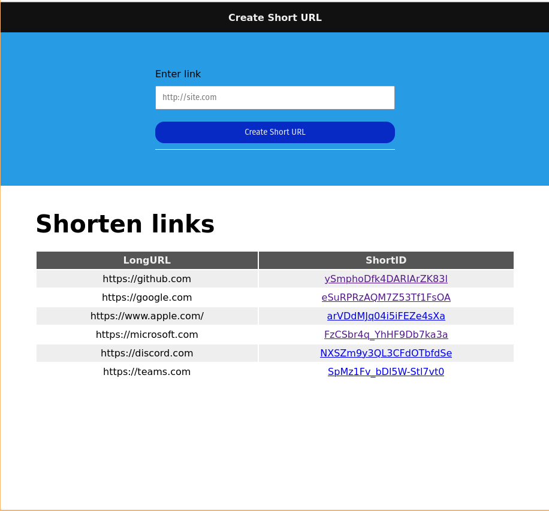

# Bienvenue dans notre projet Open Source!
Notre projet open source permet de créer des shorts cut d'url.

# Installations

```bash
npm i -g mds_open_source
mds_open_source --port=3500 --mongo="mongodb+srv://<nom>:<Password>@urls.cqgydoc.mongodb.net/?retryWrites=true&w=majority&appName=urls" --base="http://localhost:3500"
```

- Warning: put your url mongo for example with your username and your password

## Display app
Here's an image of a shortcut generator in action:

